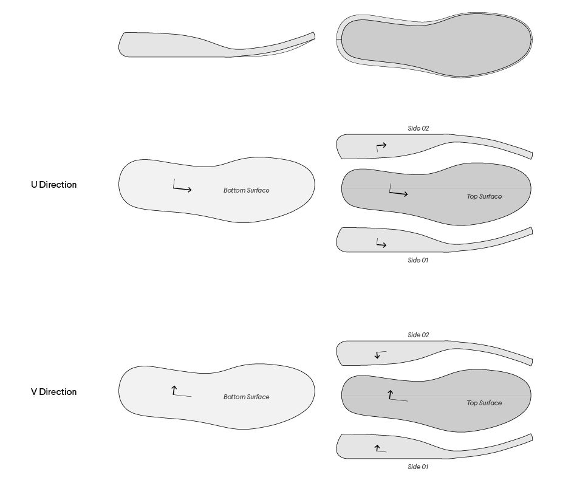

# Conformal Lattice Example

The Conformal Lattice example requires few API calls to be accomplished.

### 0. File Transfer

<b>Upload:</b>

Provided with API key, user files can be uploaded to GENYSIS server through http post request to endpoint

https://studiobitonti.appspot.com/storage/upload

Or using provided uploader example:
* <a href='https://francisbitontistudio.github.io/shoemaster_example/storage.html'>Uploader</a><br>


<b>Download:</b>

Any uploaded or generated files can be downloaded from endpoint

https://studiobitonti.appspot.com/storage/download  with parameter {name:YOUR_FILE_NAME,t:'dev'}


example:
https://studiobitonti.appspot.com/storage/download?name=lattice_example.obj&t=dev

### 1. Export Surface Grid

To create a conformed volume lattice, the 4 untrimmed envelope surfaces are needed with their uv direction aligned same way as the following diagram
<p align="center">
  
</p>

After surfaces prepared, a grid of points need to be exported from each surfaces and written into a single json file. These points will be used to rebuild same surfaces on server.
<p align="center">
  
</p>

The json file should be structured in following manner
```python
[
  # point grid for top surface
  [
    [[0,0,0],[0,0,0],[0,0,0],[0,0,0],[0,0,0]], # row of 3d points in direction u
    [[0,0,0],[0,0,0],[0,0,0],[0,0,0],[0,0,0]], # 2nd row of 3d points in direction u
    # [[...],[...]....[...]],..... # number of rows equals to number of points in direction v
  ], 
  # point grid for bottom surface
  [
    [[0,0,0],[0,0,0],[0,0,0],[0,0,0],[0,0,0]], # row of 3d points in direction u
    [[0,0,0],[0,0,0],[0,0,0],[0,0,0],[0,0,0]], # 2nd row of 3d points in direction u
    # [[...],[...]....[...]],..... # number of rows equals to number of points in direction v
  ], 
  # point grid for side01 surface
  [
    [[0,0,0],[0,0,0],[0,0,0],[0,0,0],[0,0,0]], # row of 3d points in direction u
    [[0,0,0],[0,0,0],[0,0,0],[0,0,0],[0,0,0]], # 2nd row of 3d points in direction u
    # [[...],[...]....[...]],..... # number of rows equals to number of points in direction v
  ],
  # point grid for side02 surface
  [
    [[0,0,0],[0,0,0],[0,0,0],[0,0,0],[0,0,0]], # row of 3d points in direction u
    [[0,0,0],[0,0,0],[0,0,0],[0,0,0],[0,0,0]], # 2nd row of 3d points in direction u
    # [[...],[...]....[...]],..... # number of rows equals to number of points in direction v
  ], 
]
```


The prepared json file can be uploaded through http post request to the endpoint:
https://studiobitonti.appspot.com/storage/upload

Or using provided uploader example:
* <a href='https://francisbitontistudio.github.io/shoemaster_example/storage.html'>Uploader</a><br>

### 2. Create Conformal Grid

The next step is rebuilding surfaces on server and use them to create a conformal volume grid.
Use the http post to call API endpoint: https://studiobitonti.appspot.com/conformalGrid 

Example input:
```python
{
  "u":40, # how many time to divide the surfaces in each direction 
  "v":8,
  "w":4, 
  "surfaces": "sole_example.json",  # input file name saved on server representing the surfaces
  "filename": "grid_example.json",  # output file name to be saved on server
  "directOutput": true, # if true the content of output file will be returned by the API call, otherwise, the location of the file will be returned instead.
  "unitize": false # whether to reparametricise the surface division,
  "t":"dev" # test token
}
```

Example output:
```python
[
  [
    # 3d coordinates for 8 corners of a box
    [0,0.5,0.7],[0,1.2,2.3],[3.5,-0.2,0.7],[2.5,3.2,2.22],[5.25,6.12,1.12],[5.1,-12.2,3.3],[4.6,0.11,-8],[12,2.4,-3] 
  ],
  [
    # 3d coordinates for 8 corners of a box
    [4.1,0.5,0.2],[6,1.42,1.3],[4.2,3.2,5.1],[2.3,3.1,5.52],[7.28,6.72,5.42],[5.4,11.2,5.3],[22.6,2.44,1.2]
  ],
  # [[...],[...]....[...]]...... list of boxes composing the conformal grid
]
```

* <a href='https://francisbitontistudio.github.io/shoemaster_example/grid.html'>live demo</a><br>
<p align="center">
  
</p>

### 3. Create Lattice Unit 

Use http post with API endpoint: https://studiobitonti.appspot.com/latticeUnit to generate a parametrically described lattice unit

Example input:
```python
{
  "case": 5, # choose the category of unit as integer range from 0 to 7
  "chamfer": 0.3, # the chamfer percentage from 8 corners as float from 0 to 0.5
  "centerChamfer": 0.0,  # the chamfer percentage from center as float from 0 to 0.5
  "bendIn": 0.0, # the bend in percentage for each outside edges as float from 0 to 0.5
  "cBendIn": 0.0, # the bend in percentage for each internal edges as float from 0 to 0.5
  "connectPt": 0.0, # the position for additional connection edges as float from 0 to 0.5
  "keepDup": false, # whether to keep duplicated edges, which is enssential for blended lattice, which requres multiple different units with same number of edges 
  "filename": "unit_example.obj", # output file name to be saved on server,
  "t":"dev" # test token
}
```
The output will be stored on server using specified file name 
Example output:
```python
["unit_example.obj"] # a list of successfully generated file saved on server
```
* <a href='https://francisbitontistudio.github.io/shoemaster_example/unit.html'>live demo</a><br>
<p align="center">
  
</p>

### 4. Generate Lattice

Use the API endpoint: https://studiobitonti.appspot.com/boxMorph to assemble lattice units using the conformal grid generated earlier

Example input:
```python
{
  "boxes": "grid_example.json", # name of grid file saved on server
  "component": "unit_example.obj", # name of lattice unit file saved on server
  "filename": "lattice_example.obj",
  "EPSILON": 0.01,
  "t":"dev" # test token
}
```

Example output:
```python
["lattice_example.obj"] # a list of successfully generated file saved on server
```
* <a href='https://francisbitontistudio.github.io/shoemaster_example/lattice.html'>live demo</a><br>
<p align="center">
  
</p>

The output can be downloaded here:
https://studiobitonti.appspot.com/storage/download?name=lattice_example.obj&t=dev

### 5.Meshing

* <a href='https://francisbitontistudio.github.io/shoemaster_example/meshing.html'>Live demo</a><br>

Choose desired resolution and member thickness (Radius). Click 'Run' to start computing. 
It could take 1 or 2 mins for very large files. After finished, a txt file with downloading URLs will be returned.
It is also possible to mesh previous uploaded lines obj files by specifying the field 'lines'

<p align="center">
  
</p>

<b>Check result in other CAD softwares:</b>

The result stl files can be viewed in other softwares, due to the fact meshing result file could often be very large,
thus in-browser visualization of the file is purposely disabled in this case. 

<p align="center">
  
</p>

<strong>* If the preview flag is checked, a low-poly preview version of mesh will be returned instead </strong>
<p align="center">
  
</p>

